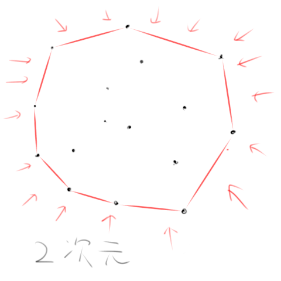
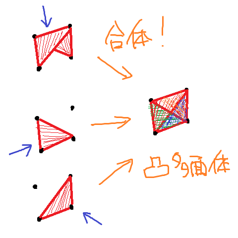
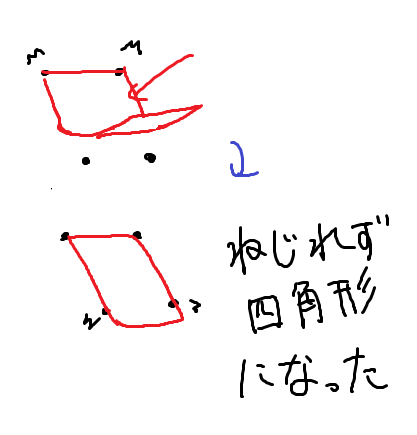

2025年の国内予選の復習です！(本番はEまでしか解けてないです...)   
G問題は3次元幾何！

## 問題
[問題リンク AOJ1687](https://onlinejudge.u-aizu.ac.jp/challenges/sources/ICPC/Prelim/1687)  
あり得る凸多面体の面の数を列挙します。

## 解法
凸多面体がよくわからないので、凸多面体について少し勉強します。   
二次元において凸多角形は、点の集合に輪っかを張るようにして覆うことでできます。  

三次元において凸多面体の面は、点の集合に対してある方向から布をかけた時にできる張った部分になります。  
凸多面体を作るには、いろんな方向から布をかけた時にできる凸多面体の面を合体すればよさそうです。  

この問題では、各点は上か下かに分けられています。  
凸多面体の面を構成する辺として
- 隣り合う上の点を結ぶ辺
- 隣り合う下の点を結ぶ辺
- 上の点と下の点を結ぶ辺   

があります。  
凸多面体は面で構成されますが、面は三角形で構成されます。
更に、三角形は３点で構成されます。  
そのため、上辺から下の点のペア、または下辺から上の点のペアで三角形の面ができます。
これらのことから、この問題では各辺が作る面について考えればよさそうです。  

サンプル1の例を見ると三角形の面が合体して四角形の面になっている場合があります。  
四角形の面が発生する場合というのは、ある方向から布をかけた時、2点に同時に接することを2回起こせる場合です。  

つまり、2辺が平行になる場合です。  
そのため、平行となるような辺のペアの場合は四角形の面になることを考慮します。  
平行といってもつながってるやつなので 上の点は時計回りなのに、下の点は反時計回りとかはNGです。  
このことから、時計回りに見た時の上辺、下辺の角度が同じ場合に四角形の面になります。(90度と90度はOK、90度と270度はNG)  

円周上の点が与えられていると見るとわかりやすいかもしれないです。

凸多面体は上(下)の点の位置をすべて$\theta$回転させた後、一意に決まります。   
各面は、順に最初は三角形の面で構成されますが、2辺が平行になっている場合に四角形の面になります。  
そのため、各$\theta$について平行となる辺のペアを求めれば、その$\theta$における面の数がわかります。
ありえる$\theta$は無数にあるので最初に平行になる辺のペアで全探索します。  
また、どれも平行にならない場合は作れます。(小さくねじるよ)

実装では、内角ではなく外角を使って、その累積和がその辺の角度となるため、実装がしやすいかもしれないです。
### 実装
[実装辛い...整数に変換してやりました](https://onlinejudge.u-aizu.ac.jp/solutions/problem/1687/review/11244148/zubasyan/C++23)

### まとめ
凸多面体の性質などを理解してないと解くのは難しいと思いました。  
実装も注意点が多いので大変ですが、チームワークがいいチームはうまくできそうです。  
本番に解けているチームは天才です！